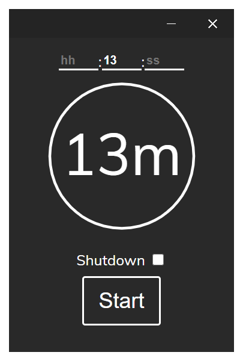
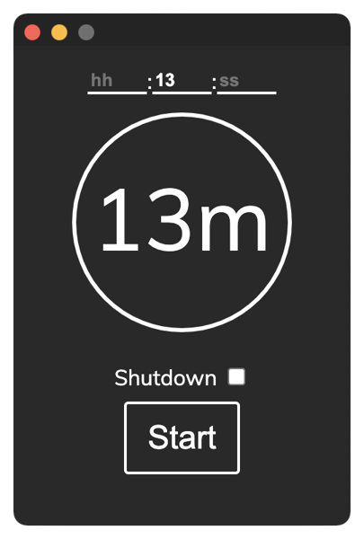

# Sleep Timer

A tool that automatically changes your PC's power state after a set amount of time"

Technologies used:

* [Tauri](https://tauri.app/)
* [Svelte](https://svelte.dev/)
* [SCSS](https://sass-lang.com/)

## How to compile yourself

1. Install dependencies using pnpm
2. Run `pnpm tauri build`

## Screenshots

